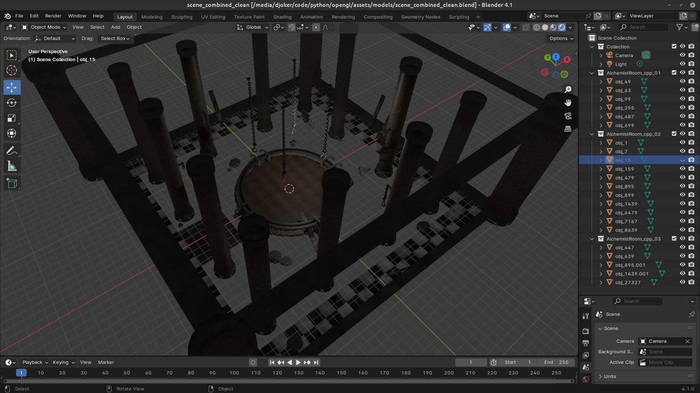
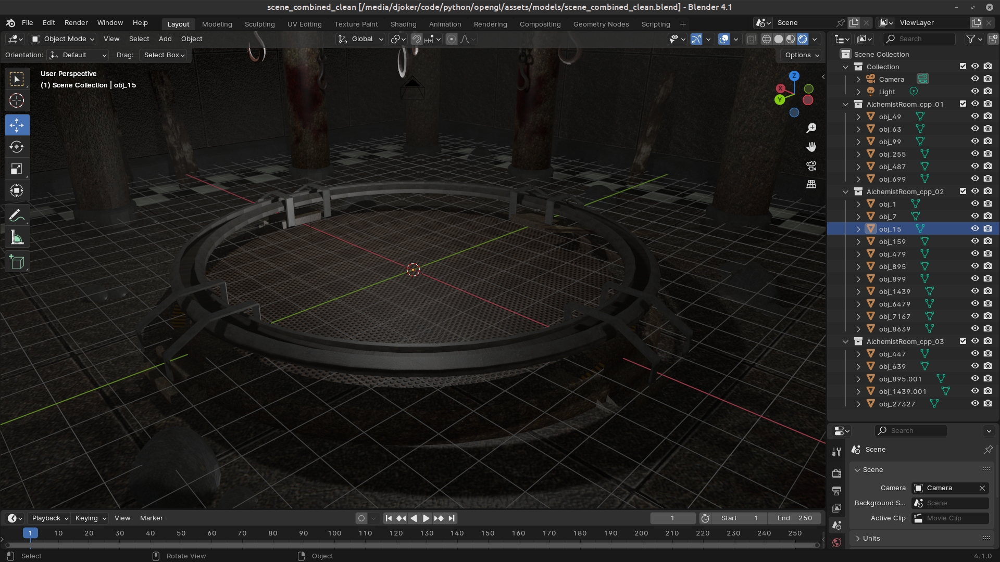
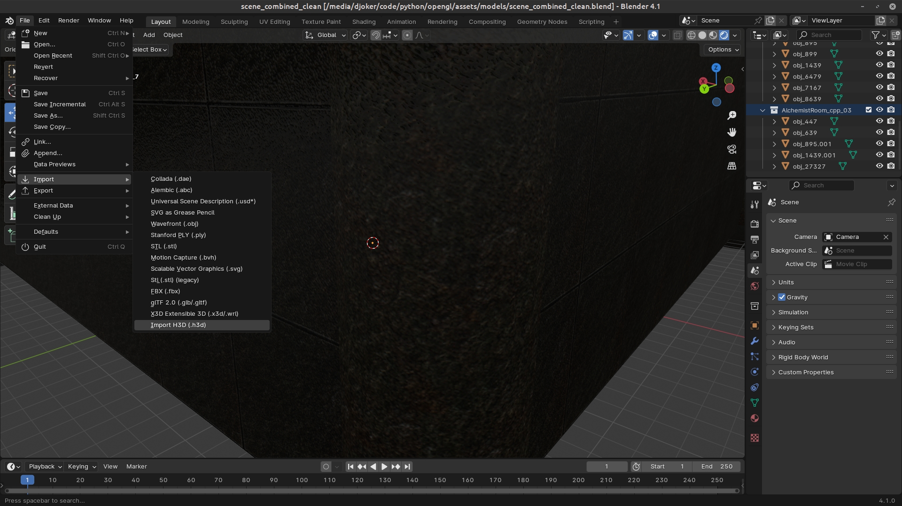
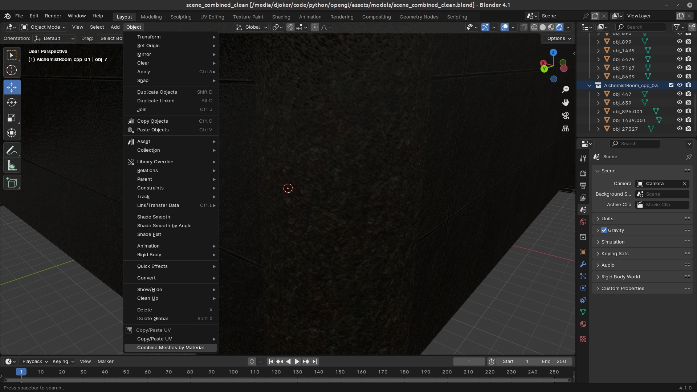

# Mesh H3D - Model Import and Optimization Tool

This project provides a powerful toolset for importing, optimizing, and exporting 3D models using Assimp and Blender 4.1.0. 
The toolkit includes C++ code for importing models, optimizing meshes, and combining surfaces with identical materials. 
It also supports exporting in an H3D format, organized in chunks for efficient reading. Additionally, Blender plugins 
and scripts allow seamless importing, exporting, and material-based mesh combination.

## Features

- **Model Import with Assimp**: Imports various 3D model formats using Assimp for efficient handling of 3D assets.
- **Mesh Optimization**: Cleans up and combines surfaces with the same material to reduce complexity and improve performance.
- **Custom H3D Format Export**: Exports models to a custom H3D binary format using chunks for structured data storage and easy reading.
- **Blender Plugin**: A plugin for Blender 4.1.0 to import/export models in H3D format.
- **Material-Based Mesh Combination Script**: Combines multiple meshes with the same material in Blender and removes unused materials.


## Dependencies

- **Assimp**: Used for model import and preprocessing. Ensure Assimp is installed and linked.
- **Blender 4.1.0**: The plugin and scripts are compatible with Blender 4.1.0.
- **C++ Compiler**: A compiler supporting at least C++11 (or C++17, as preferred).
- **Python**: Required for running Blender scripts.

## Installation

### 1. Clone the Repository
```bash
git clone https://github.com/akadjoker/mesh_h3d.git
cd mesh_h3d
```

### 2. Build the C++ Project
Ensure Assimp is installed and available for linking.
```bash
mkdir build
cd build
cmake ..
make
```

### 3. Install the Blender Plugins
- Navigate to Blender's `Edit > Preferences > Add-ons > Install`.
- Select the plugin files from the `blender_plugin` folder:
  - `object_material_join.zip`: For combining meshes with the same material and removing unused materials.
  - `h3d_import_export.zip`: For importing and exporting models in H3D format.
- Enable both plugins.

## Usage

### C++ Code
1. **Model Import**: Use the C++ code to load models through Assimp.
2. **Mesh Optimization**: Automatically combines surfaces with the same material and optimizes the mesh.
3. **H3D Export**: Exports the optimized model to the H3D format with chunks, allowing for efficient data access.

### Blender Plugin and Script
- **Import/Export in H3D Format**: Use the H3D Import/Export plugin in Blender to load and save models in H3D format.
- **Combine Meshes with the Same Material**:
  - Go to `Object > Combine Meshes by Material` in Blender to merge meshes with identical materials and clean up unused materials.


- **Combine Meshes in Blender**:
  In Blender, use the "Combine Meshes by Material" tool from the plugin menu for material-based optimization.

## H3D File Format

The H3D format is structured into chunks for easy parsing and data handling:
- `MAT#`: Contains material data.
- `TEX#`: Stores texture information.
- `SURF`: Organizes mesh surfaces.
- `VRTS`: Vertex information.
- `TRIS`: Triangle index data.

Each chunk is structured to simplify the import process and minimize file size.

## Screenshots

### Model Import and Optimization



### Blender Plugin and H3D Export



## TODO
Animations
